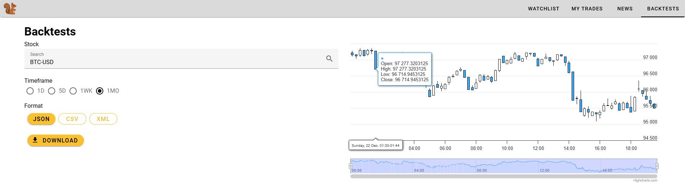

# SquirrelTrade
Final project for course *Web Applications: Frontend*, taught at [PEF MENDELU](https://pef.mendelu.cz/), graded 39/60 points (because we didn't include unit and UI tests)

## Description
This web application is designed for individuals interested in exploring stock market and cryptocurrency investments. It provides an intuitive and interactive interface to track market trends, manage watchlists, execute trades, and access financial news.

## Features

### Homepage
- **Global Markets**: Displays 5 world markets with interactive price charts.
- **Market Movers**: Highlights the **Top 5 Gainers** and **Top 5 Losers** in the last 24 hours.
- **Search Bar**: Quickly search for stocks and cryptocurrencies. Click on a result to access detailed information.

### Details Page
- View **current price**, **interactive chart**, **full name**, and **symbol**.
- Option to **add to watchlist** or place an **order by quantity**.

---

## Tabs Overview

### 1. Watchlist
- Displays your saved stocks in a table with the following details:
  - Name, Closing Price, Daily Change, High/Low Prices.
- Option to remove items from the watchlist.

### 2. My Trades
- Tracks all stocks you’ve ordered:
  - Name, Order Date, Quantity, Current Price, Profit/Loss.
- Includes an option to sell your holdings.

### 3. News
- Stay updated with the latest market news:
  - Expand for a short description or click "Open" to read the full article in a new window.

### 4. Backtests
- Perform historical price backtesting:
  - Search for a stock, select a timeframe, and download results in **JSON**, **CSV**, or **XML** format.

## Installation

1. Clone this repository.
2. Navigate to root of the repository.
3. run `npm install --force`.

### Running Locally
1. run `npm run dev`.
2. Website should be available at http://localhost:3000

### Deployment on web
1. run `npm run build`.
2. copy the `dist` folder to your web server
## Environment Variables

To run this project, you will need to add the following environment variables to your .env file.

`VITE_CRYPTO_COMPARE_API_KEY` [Get it here for free](https://min-api.cryptocompare.com/)

`VITE_ALPACA_API_KEY` and `VITE_ALPACA_SECRET` [Get it here for free](https://alpaca.markets/)

And ideally use some better cors proxy `VITE_DEFAULT_PROXY`

## Authors
- [David Krčmář](https://www.linkedin.com/in/david-krcmar-943182235/)
- [Jiří Daniel Šuster](https://www.linkedin.com/in/ji%C5%99%C3%AD-daniel-%C5%A1uster-7017b0306/)

## Screenshots

## License

[MIT](https://choosealicense.com/licenses/mit/)

